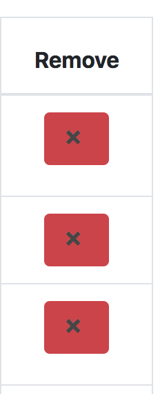
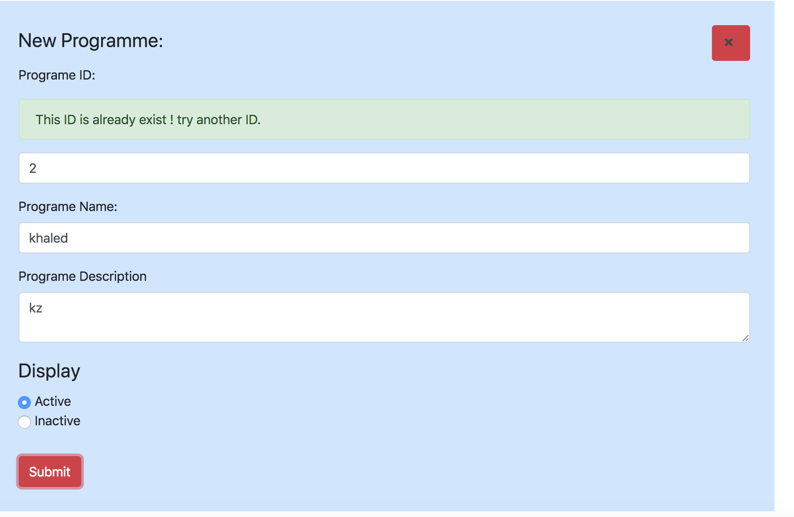

## Front End Developer: Practical Test - STV 

##Run the project

### `npm start`

Runs the app in the development mode. 
Open [http://localhost:3000](http://localhost:3000) to view it in the browser.

The page will reload if you make edits. 
You will also see any lint errors in the console.

This project created by Khaled Al Kharaz.

##CRUD React Application 

### User Stories 

  User Can see table of STB programme

  User Can search for any programme

  User Can delete any programme

  User Cam add new programme 

  User can know the active and inactive programme, inactive prog appears grayed out

  User can sort table by programme name or by programme id

### Libraries used in this project

  Redux 
  ReactStrip 
  ES6 

## Single-page React app - no page refreshes
  One central state to hold all data and one local state to hold the data are not necessary nned to be saved to central state especial handleChange functions.

## Thing need to be improved
 Not sure about the sort by name if it's fine to display the name start with numbers first 
 The header row should change when we do search for programme because if the result is one no need to display sort image
 The search function nead to be improved it's not enough to display only the result if the user write the full name of the project

## nice to have
 Edit programme 
 Unit test it will be easy because we use redux so we can test the reducers and test the components.

## an app that works reliably without bugs 

### User Get Data
Msg:STV — Programme Table check it out!
with BLUE background

### Programme Table Empty
MSG: STV — Programme Table it Empty!with red background
with red background

### if the user not connected to the internet 
MSG: Please check your connection 
with red background

note: this will not happen in this case because we using mock data and we are not feetching any data from server

## Add Programme

### check if name/id/description/active added before add programme

### Name

### ID

### Description

### check the id is unique before add the new programme

